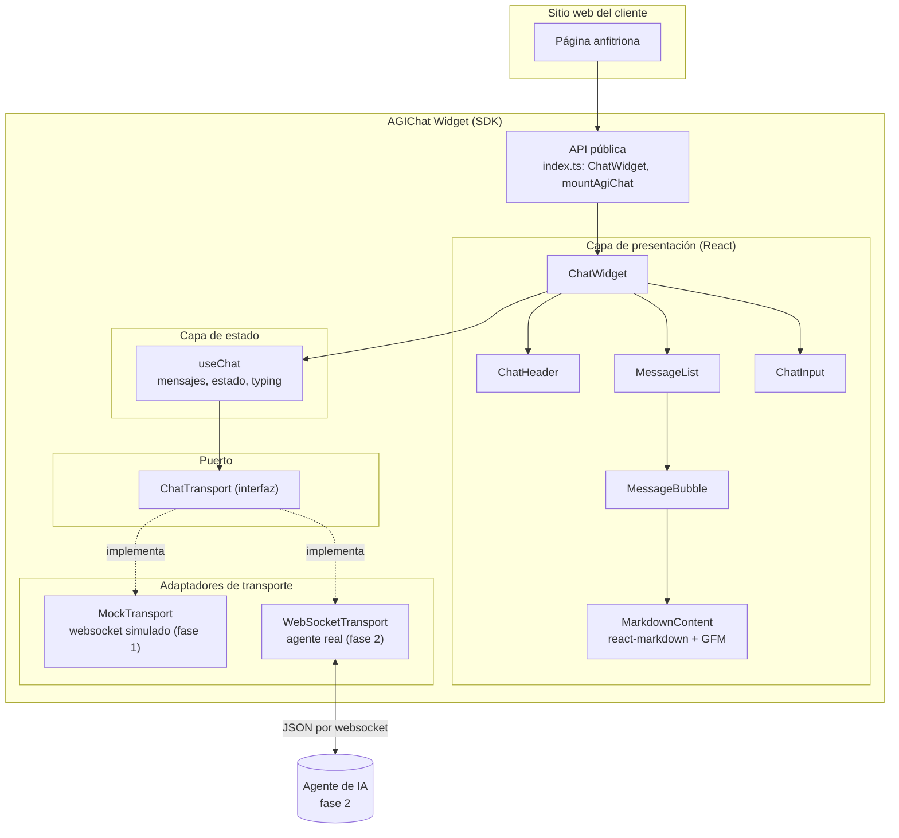
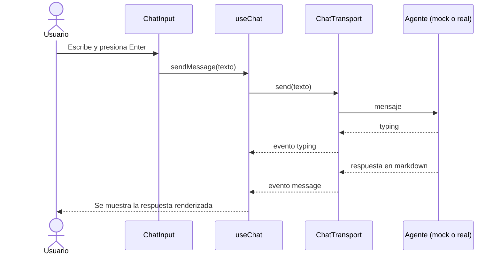

# AGIChat Widget

SDK para que cualquier cliente de AGIChat agregue a su sitio un chat con un agente de IA usando una sola línea de código. El widget está hecho con React y TypeScript, se empaqueta como librería con Vite y hoy se conecta a un endpoint simulado, de forma que en la fase 2 solo haya que cambiar el transporte por el agente real sin tocar la interfaz.

## Cómo correrlo

Se necesita Node 22 o superior. Después de clonar el repositorio se instalan las dependencias con `npm install` y se levanta la demo con `npm run dev`, que abre una página de ejemplo con el widget en la esquina inferior derecha.

| Comando | Para qué sirve |
| --- | --- |
| `npm run dev` | Levanta la página de demo con recarga en caliente |
| `npm run lint` | Revisa el estilo de código con ESLint |
| `npm run typecheck` | Revisa los tipos con TypeScript |
| `npm test` | Corre las pruebas una vez |
| `npm run coverage` | Corre las pruebas y falla si el coverage baja del 80% |
| `npm run build` | Compila la demo en `dist/` |

## Cómo se usa el SDK

Dentro de una app de React basta con renderizar el componente:

```tsx
import { ChatWidget } from 'agichat-widget';

<ChatWidget title="Soporte" greeting="¡Hola! ¿En qué te ayudo?" accentColor="#3d4fd8" />
```

En un sitio que no usa React se monta con la función `mountAgiChat`:

```ts
import { mountAgiChat } from 'agichat-widget';

mountAgiChat(document.getElementById('chat')!, { title: 'Soporte' });
```

Para la fase 2 se le pasa el transporte del agente real, por ejemplo `new WebSocketTransport('wss://api.agichat.com/ws')`, y el resto queda igual.

## Arquitectura

Elegimos una arquitectura por capas con el patrón de puertos y adaptadores (hexagonal), porque el requisito más fuerte del proyecto es que la interfaz quede lista mientras el agente todavía no existe. La UI nunca habla directo con un servidor, sino con la interfaz `ChatTransport`, que funciona como puerto; detrás de ese puerto hay adaptadores intercambiables, hoy el `MockTransport` que simula un websocket con respuestas en markdown y el `WebSocketTransport` ya preparado para el agente real. Así el cambio de la fase 2 se reduce a instanciar otro adaptador, cada capa se puede probar por separado (por eso es fácil sostener el coverage arriba del 80%) y, como se distribuye como SDK, los clientes solo ven la API pública de `src/index.ts` y no dependen de los detalles internos.



El flujo de un mensaje es sencillo, el usuario escribe en `ChatInput`, `useChat` agrega el mensaje a la lista y lo manda por el transporte, el transporte avisa que el agente está escribiendo y luego devuelve la respuesta, que `MessageBubble` renderiza como markdown.



## Estructura de carpetas

```text
agichat-widget/
├── .github/
│   ├── workflows/ci.yml          # Pipeline: lint, tests con coverage, build y deploy a GitHub Pages
│   └── pull_request_template.md  # Checklist que se llena en cada PR
├── src/
│   ├── index.ts                  # API pública del SDK, lo único que ven los clientes
│   ├── main.tsx                  # Página de demo (no se incluye en el SDK)
│   ├── components/               # Componentes visuales del widget, cada uno con su responsabilidad
│   ├── hooks/                    # Lógica de estado del chat (useChat)
│   ├── transport/                # Puerto ChatTransport y sus adaptadores (mock y websocket)
│   ├── types/                    # Tipos compartidos (mensajes, eventos, estados)
│   ├── styles/                   # CSS del widget con prefijo agc- y CSS de la demo
│   └── test/                     # Setup de Vitest y transporte falso para pruebas
├── AGENTS.md                     # Guía para herramientas de codeo agéntico
├── eslint.config.js              # Reglas de estilo de código
├── vite.config.ts                # Config de Vite y de Vitest (umbral de coverage del 80%)
└── package.json
```

Si sos nuevo en el proyecto, lo más práctico es empezar por `src/index.ts` para ver qué se expone, seguir con `components/ChatWidget.tsx` que arma todo el widget y terminar en `transport/`, que es donde se conecta el agente. Las pruebas viven junto al archivo que prueban con el sufijo `.test.ts` o `.test.tsx`.

## Cómo contribuir (GitHub Flow)

La rama `main` siempre debe estar estable y desplegable, por eso nadie hace push directo a ella. Para cualquier cambio se crea una rama desde `main` con un nombre descriptivo, como `feature/historial-mensajes` o `fix/scroll-input`, se hacen commits pequeños, se abre un Pull Request hacia `main` y se espera a que el pipeline pase y que al menos un compañero lo revise y apruebe. Al hacer merge, el pipeline vuelve a correr sobre `main`, compila el proyecto y publica la demo en GitHub Pages.

## Pipeline de CI/CD

Cada Pull Request corre tres revisiones, el lint de ESLint junto con la revisión de tipos, las pruebas con Vitest que fallan si cualquier métrica de coverage baja del 80%, y el build, que solo se ejecuta si las dos anteriores pasaron. Esa es la parte de integración continua, y cuando el cambio entra a `main` se agrega la entrega continua, que despliega automáticamente la demo en GitHub Pages para que cualquiera la pruebe sin instalar nada.
